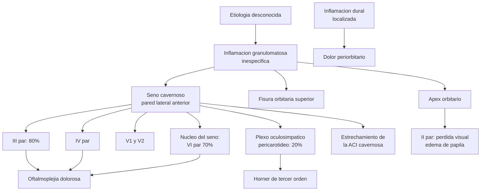
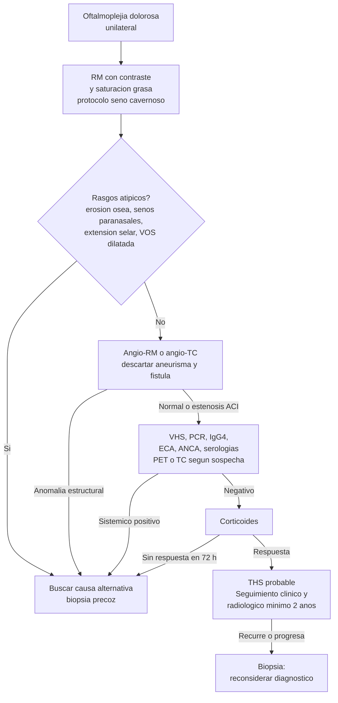

> **Enfoque solicitado:** diagnóstico y diagnóstico diferencial (secciones 5 y 6 desarrolladas en profundidad) **Fuentes:** 18 (0 guías · 4 revisiones sistemáticas/meta-análisis · 0 ECAs · 14 otras) · 2008–2026 **Generado:** 6 de agosto de 2026 · Contexto asumido: Chile, neurología especializada **Advertencia de base:** entidad rara. **No existe ninguna guía de sociedad ni ningún ensayo controlado.** Toda la evidencia es observacional: series retrospectivas, casos y revisiones sistemáticas de ambos. La sección 7 es proporcionalmente extensa porque es donde está lo que de verdad determina la conducta.

---

## 1. Definición

Oftalmoplejía dolorosa unilateral causada por inflamación granulomatosa idiopática del **seno cavernoso, la fisura orbitaria superior o el ápex orbitario**, con paresia de uno o más nervios oculomotores y respuesta característica a corticoides \[1,2\].

Descrito por Tolosa en 1954 y por Hunt et al. en 1961 \[3\]. Es uno de los epónimos más reconocidos de la neurología y, según los propios revisores del tema, **también uno de los más mal usados**, por no adherir a los criterios diagnósticos \[1\]. Revisiones recientes coinciden en el mismo diagnóstico del problema \[6,9\].

### La definición operativa vigente: ICHD-3

En la ICHD-3 (2018) el síndrome está en **13.8**, dentro de "lesiones dolorosas de los nervios craneales y otros dolores faciales" \[1,2\].

> **Ojo con la numeración.** Buena parte de la literatura cita **13.7**, que era el número en la ICHD-3 *beta*. En la versión definitiva es 13.8. Al citar criterios, verifica de qué versión habla el artículo — muchos trabajos de "validación de los criterios ICHD-3" validaron en realidad los de la beta.

**Criterios ICHD-3 (13.8)** \[2,16\]:

<table fit-page-width="true" header-row="true">
	<tr>
		<td></td>
		<td>Criterio</td>
	</tr>
	<tr>
		<td>**A**</td>
		<td>Cefalea orbitaria/periorbitaria unilateral que cumple el criterio C</td>
	</tr>
	<tr>
		<td>**B**</td>
		<td>Ambos: **B1.** inflamación granulomatosa del seno cavernoso, fisura orbitaria superior u órbita, demostrada por **RM o biopsia**; **B2.** paresia de uno o más de los nervios III, IV y/o VI ipsilaterales</td>
	</tr>
	<tr>
		<td>**C**</td>
		<td>Evidencia de causalidad, ambos: **C1.** cefalea ipsilateral a la inflamación granulomatosa; **C2.** la cefalea precedió a la paresia en ≤2 semanas o apareció con ella</td>
	</tr>
	<tr>
		<td>**D**</td>
		<td>No mejor explicado por otro diagnóstico de la ICHD-3</td>
	</tr>
</table>

### Cómo cambió la definición, y por qué importa

La evolución de los criterios no es un tecnicismo: **redefine qué pacientes son "Tolosa-Hunt"** \[1\].

<table fit-page-width="true" header-row="true">
	<tr>
		<td></td>
		<td>ICHD-1 (1988)</td>
		<td>ICHD-2 (2004)</td>
		<td>ICHD-3 (2018)</td>
	</tr>
	<tr>
		<td>Sección</td>
		<td>12.1.5</td>
		<td>13.16</td>
		<td>**13.8**</td>
	</tr>
	<tr>
		<td>Imagen</td>
		<td>Sin mención</td>
		<td>**Opcional** (paresia *y/o* granuloma)</td>
		<td>**Obligatoria** (RM o biopsia)</td>
	</tr>
	<tr>
		<td>Respuesta a corticoides</td>
		<td>**Criterio C** (alivio <72 h)</td>
		<td>**Criterio D** (resuelve <72 h)</td>
		<td>**Eliminada de los criterios**</td>
	</tr>
	<tr>
		<td>Exclusión de otras causas</td>
		<td>Criterio D (neuroimagen)</td>
		<td>Criterio E</td>
		<td>Criterio D</td>
	</tr>
</table>

Dos consecuencias directas:

1. **La respuesta a corticoides dejó de ser criterio diagnóstico** — sigue siendo un dato clínico usado a diario, pero ya no define la entidad. La razón es sólida: linfoma, sarcoidosis y otros mimics también responden a esteroides, así que usarla como criterio genera falsos positivos peligrosos.
2. **La imagen pasó de irrelevante a obligatoria**, lo que expulsó de la definición a un subgrupo entero (ver §7.2).

**Nomenclatura:** CIE-10 **G44.850** · Orphanet **ORPHA:3129** · ICHD-3 **13.8**.

---

## 2. Epidemiología

<table fit-page-width="true" header-row="true">
	<tr>
		<td>Parámetro</td>
		<td>Valor</td>
		<td>Fuente</td>
	</tr>
	<tr>
		<td>Incidencia estimada</td>
		<td>**1–2 casos por millón por año**</td>
		<td>\[2\]</td>
	</tr>
	<tr>
		<td>Proporción de los síndromes de seno cavernoso</td>
		<td>**~23%**</td>
		<td>\[2\]</td>
	</tr>
	<tr>
		<td>Edad media de inicio</td>
		<td>Cuarta década</td>
		<td>\[2\]</td>
	</tr>
	<tr>
		<td>Sexo</td>
		<td>**Sin predilección**</td>
		<td>\[2\]</td>
	</tr>
	<tr>
		<td>Predominio geográfico o racial</td>
		<td>No descrito</td>
		<td>\[2\]</td>
	</tr>
</table>

> Las cifras de incidencia son estimaciones de revisión narrativa, no de estudios poblacionales. Para una entidad definida por criterios que cambiaron tres veces y con especificidad ~50% (§5), cualquier tasa de incidencia arrastra esa imprecisión. **No hay datos chilenos ni latinoamericanos.**

Un sesgo relevante para interpretar los datos de recurrencia: de los 456 pacientes del meta-análisis de 2026, **135 eran de India, 119 de China/Taiwán y 97 de Corea del Sur** — es decir, ~77% de origen asiático. Los autores lo señalan como límite de generalización \[3\].

---

## 3. Fisiopatología

Inflamación granulomatosa inespecífica del seno cavernoso y estructuras vecinas, de **etiología desconocida** \[1,2\]. El hallazgo histopatológico es infiltrado granulomatoso crónico con fibroblastos abundantes, linfocitos y células plasmáticas, células epitelioides y ocasionales células gigantes, que infiltra los septos y las paredes del seno cavernoso \[2\].

Algunos autores lo consideran una variante del síndrome inflamatorio orbitario (pseudotumor) con extensión al ápex orbitario, o una paquimeningitis hipertrófica idiopática focal \[2\]. **No hay consenso sobre su naturaleza**, y esa indefinición es la raíz de casi todos los problemas diagnósticos de la §7.

*Figura 1. Corte coronal del seno cavernoso con rótulos en español. Autor: Johannes Sobotta (1908), modificaciones de Senda1234, Wikimedia Commons, CC BY-SA 4.0. URL verificada (HTTP 200) el 06-08-2026.*

**Por qué la anatomía explica la clínica:** el proceso afecta preferentemente la **pared lateral anterior** del seno, donde discurren III, IV, V1 y V2 — de ahí que el III par sea el más comprometido (~80%). El VI par corre por el **interior** del seno, junto a la carótida, así que su compromiso (~70%) implica extensión al núcleo del seno. El plexo simpático pericarotídeo explica el Horner de tercer orden (~20%) y, ocasionalmente, proptosis por contracción del músculo de Müller \[2\].

---

## 4. Clínica

<table fit-page-width="true" header-row="true">
	<tr>
		<td>Manifestación</td>
		<td>Frecuencia</td>
		<td>Valor discriminante</td>
	</tr>
	<tr>
		<td>Dolor periorbitario/retroocular unilateral</td>
		<td>Prácticamente constante, define el cuadro</td>
		<td>**Alto** en conjunto con oftalmoplejía; bajo aislado</td>
	</tr>
	<tr>
		<td>Paresia del **III par**</td>
		<td>**~80%**</td>
		<td>Media</td>
	</tr>
	<tr>
		<td>Paresia del **VI par**</td>
		<td>**~70%**</td>
		<td>Media</td>
	</tr>
	<tr>
		<td>Paresia del IV par</td>
		<td>Variable</td>
		<td>Media</td>
	</tr>
	<tr>
		<td>Compromiso de V1 (± V2)</td>
		<td>Frecuente</td>
		<td>Media</td>
	</tr>
	<tr>
		<td>Horner de tercer orden</td>
		<td>**~20%**</td>
		<td>**Alto** — localiza en seno cavernoso</td>
	</tr>
	<tr>
		<td>Compromiso del II par (pérdida visual)</td>
		<td>Minoría, por extensión al ápex</td>
		<td>**Bandera roja**: obliga a replantear el diagnóstico</td>
	</tr>
	<tr>
		<td>Proptosis</td>
		<td>Subgrupo pequeño</td>
		<td>Media</td>
	</tr>
</table>

**Cronología típica:** el dolor precede a la oftalmoplejía hasta en 2 semanas y, sin tratar, dura en promedio **~8 semanas** \[2\]. El compromiso puede ser unilateral, secuencial o bilateral simultáneo.

> **Advertencia sobre el compromiso del II par.** Si hay pérdida visual, el proceso se extendió al ápex orbitario. Aunque puede ocurrir en THS genuino, es también el patrón de los mimics más graves (linfoma, hongos), y en el meta-análisis de recurrencia el compromiso del II par se asoció a mayor riesgo de recaída \[3\]. Baja el umbral para biopsia.

---

## 5. Diagnóstico

### 5.1 El gold standard y su problema central

**El patrón de oro es la histopatología** — inflamación granulomatosa crónica con las características descritas en §3 \[2\]. Pero está limitado en la práctica: obtener muestra del seno cavernoso es técnicamente difícil por su profundidad y por los nervios craneales que lo rodean \[2\]. En la mayoría de los casos **no se biopsia**.

De ahí la contradicción operativa que define a esta entidad: **la ICHD-3 exige demostrar inflamación *granulomatosa* por RM o biopsia, pero la RM no puede distinguir tejido granulomatoso de cualquier otro tejido anómalo que capte contraste** \[1\]. En la práctica, la mayoría de los diagnósticos se hacen con un criterio que la técnica empleada no puede realmente satisfacer.

**Rendimiento de los criterios ICHD-3:** sensibilidad **~95–100%**, especificidad **~50%** \[2\].

Esa especificidad es el dato clínico más importante de este informe. Significa que **aproximadamente la mitad de los pacientes que cumplen criterios ICHD-3 tienen otra cosa**. El diagnóstico sigue siendo, en los hechos, de exclusión, y varios autores han cuestionado abiertamente seguir usando el epónimo para "inflamación granulomatosa presunta del seno cavernoso" \[2\].

### 5.2 Resonancia magnética

**Protocolo.** La neuroimagen convencional no visualiza bien el seno cavernoso. Se requieren secuencias **T1 y T2 turbo-spin-echo con contraste y saturación grasa, en cortes coronales y axiales**, revisando explícitamente ápex orbitario, fisura orbitaria superior y lóbulo temporal anterior \[2\]. Se ha propuesto un "protocolo Tolosa-Hunt" dedicado, con RM dinámica para diagnóstico precoz \[2\].

**Hallazgos característicos** \[1,2,7,14\]:

<table fit-page-width="true" header-row="true">
	<tr>
		<td>Signo</td>
		<td>Descripción</td>
	</tr>
	<tr>
		<td>Contorno</td>
		<td>Convexidad de la pared lateral del seno cavernoso (normalmente cóncava o recta)</td>
	</tr>
	<tr>
		<td>T1</td>
		<td>Tejido blando **isointenso** con sustancia gris</td>
	</tr>
	<tr>
		<td>T2</td>
		<td>**Iso a levemente hipointenso**</td>
	</tr>
	<tr>
		<td>Contraste</td>
		<td>**Realce marcado**</td>
	</tr>
	<tr>
		<td>Difusión</td>
		<td>Restricción en DWI</td>
	</tr>
	<tr>
		<td>Vascular</td>
		<td>Estrechamiento focal de la porción cavernosa de la ACI</td>
	</tr>
	<tr>
		<td>Meninges</td>
		<td>Realce dural adyacente (paquimeningitis focal)</td>
	</tr>
</table>

**RM superior a TC.** La TC de alta resolución muestra partes blandas y cambios óseos (erosión, hiperostosis, calcificación), pero tiene sensibilidad limitada para lesiones del seno cavernoso y sufre artefactos de endurecimiento del haz \[2\].

### 5.3 Hallazgos atípicos que obligan a buscar otro diagnóstico

Esta lista es probablemente lo más útil de toda la sección. En un análisis retrospectivo de 61 pacientes con oftalmoplejía dolorosa, la identificación de estos rasgos discriminó otras etiologías antes de etiquetar como THS \[1,2\]:

- Extensión a la **fosa selar**, fosa craneal media o **fosa infratemporal**
- Lesión **posterior a la cisterna prepontina**
- Invasión de **senos paranasales**, parénquima cerebral o cráneo
- **Erosión ósea**
- **Dilatación y realce de la vena oftálmica superior**

> **Regla práctica de Förderreuther y Straube, citada por \[1\]:** hallazgos de RM o TC compatibles con tejido inflamatorio **ni excluyen ni confirman** THS, y deben considerarse sospechosos hasta descartar tumor maligno o inflamación distinta. Recomendaron seguimiento clínico y radiológico **por al menos 2 años**, incluso con RM inicial negativa.

**La resolución radiológica va por detrás de la clínica** y puede tardar varios meses \[1,2\]. Sin confirmación histopatológica, la imagen de seguimiento es imprescindible para detectar respuesta parcial o nula, progresión de la lesión, y para decidir cuándo suspender esteroides \[1\].

### 5.4 Imagen vascular

No está en los criterios ICHD-2 ni ICHD-3, pero **la estenosis de la ACI era parte del caso original de Tolosa (1954)** \[1\]. Sigue siendo útil por dos razones distintas:

**Descartar mimics vasculares** — fístula carótido-cavernosa, aneurisma cavernoso o paraselar, arteritis de células gigantes, hemangioma \[1\].

**Aportar confirmación indirecta.** En la revisión de 121 casos con evaluación del calibre de la ACI, hubo anomalía vascular en **44 (36,4%)**, siendo el estrechamiento de la ACI cavernosa la más frecuente (**39/43**) \[1\]. En pediatría se ha descrito estrechamiento en el **44%** de los casos \[1\]. Lo relevante: **el estrechamiento revierte tras corticoides**, y esa reversión funciona como confirmación indirecta.

Cómo distinguir el patrón vascular del THS del de sus mimics \[1\]:

<table fit-page-width="true" header-row="true">
	<tr>
		<td>Entidad</td>
		<td>Comportamiento de la ACI cavernosa</td>
	</tr>
	<tr>
		<td>**THS**</td>
		<td>Estrechamiento que **revierte** con esteroides</td>
	</tr>
	<tr>
		<td>Adenoma hipofisario</td>
		<td>Engloba la ACI pero **no la estrecha**</td>
	</tr>
	<tr>
		<td>Meningioma</td>
		<td>Estrecha la luz pero **no revierte**; base dural ancha, cola dural</td>
	</tr>
	<tr>
		<td>Linfoma</td>
		<td>Agranda el seno **sin comprimir** la ACI; extensión por forámenes de la base</td>
	</tr>
	<tr>
		<td>Granulomatosis con poliangeítis</td>
		<td>Señal **marcadamente baja en T2** por fibrosis interna; senos paranasales y órbita afectados</td>
	</tr>
	<tr>
		<td>Infección fúngica</td>
		<td>Estenosis u oclusión, **riesgo de aneurisma micótico**; realce intenso no homogéneo, enfermedad paranasal, destrucción ósea; signos radiológicos **no revierten**</td>
	</tr>
</table>

**Complicaciones vasculares graves.** De 121 casos, algunos desarrollaron aneurisma de ACI y fístulas durales arteriovenosas que requirieron embolización con coils \[1\]. En 54 casos de THS "benigno", cuatro tenían anomalías vasculares, dos de ellas fístulas AV durales de aparición tardía \[1\].

### 5.5 Otros estudios

<table fit-page-width="true" header-row="true">
	<tr>
		<td>Estudio</td>
		<td>Utilidad</td>
	</tr>
	<tr>
		<td>**VHS, PCR, hemograma**</td>
		<td>Pueden elevarse en fase aguda. Valor pronóstico incierto (§7.6)</td>
	</tr>
	<tr>
		<td>**ANA y anticuerpos**</td>
		<td>Pueden estar presentes; inespecíficos</td>
	</tr>
	<tr>
		<td>**LCR**</td>
		<td>Suele ser **normal**; pleocitosis leve o proteínas algo altas son posibles y esteroide-sensibles. **Alteración marcada o persistente obliga a buscar otra causa neuroinflamatoria**</td>
	</tr>
	<tr>
		<td>**PET-FDG / TC tórax-abdomen**</td>
		<td>Cribado de enfermedad sistémica y neoplasia en casos seleccionados. Hipermetabolismo focal apoya inflamación; baja especificidad</td>
	</tr>
	<tr>
		<td>**IgG4 sérico**</td>
		<td>Ver §6.2. Un valor alto **no basta** para diagnosticar enfermedad por IgG4</td>
	</tr>
	<tr>
		<td>**Biopsia**</td>
		<td>Gold standard. Indicada cuando hay rasgos atípicos, falta de respuesta o recurrencias múltiples</td>
	</tr>
</table>

### 5.6 Algoritmo

### 5.7 Disponibilidad en Chile

La RM con protocolo dedicado de seno cavernoso requiere solicitarla explícitamente — un protocolo de cerebro estándar **no basta** y es una causa frecuente de estudio no diagnóstico. IgG4 sérico está disponible en laboratorios privados. La biopsia del seno cavernoso exige neurocirugía de base de cráneo, disponible solo en centros terciarios. *Esta observación refleja práctica corriente, no una fuente publicada.*

---

## 6. Diagnóstico diferencial

**Tolosa-Hunt es un diagnóstico de exclusión** \[2\]. Con especificidad ~50% de los criterios, esta sección no es un apéndice: es la mitad del trabajo diagnóstico.

### 6.1 Causas de oftalmoplejía dolorosa

<table fit-page-width="true" header-row="true">
	<tr>
		<td>Grupo</td>
		<td>Entidades</td>
		<td>Qué la sugiere frente a THS</td>
	</tr>
	<tr>
		<td>**Vascular**</td>
		<td>Aneurisma de comunicante posterior</td>
		<td>Midriasis con compromiso pupilar precoz, cefalea en trueno</td>
	</tr>
	<tr>
		<td></td>
		<td>**Aneurisma de ACI cavernosa**</td>
		<td>Descrito como mimic con presentación idéntica \[4\]; angio obligatoria</td>
	</tr>
	<tr>
		<td></td>
		<td>Fístula carótido-cavernosa</td>
		<td>Soplo, quemosis, ingurgitación epiescleral, **VOS dilatada**</td>
	</tr>
	<tr>
		<td></td>
		<td>Trombosis de seno cavernoso</td>
		<td>Fiebre, compromiso bilateral, foco séptico</td>
	</tr>
	<tr>
		<td></td>
		<td>Neuropatía isquémica diabética</td>
		<td>**Respeta la pupila**, dolor menor, resolución espontánea en semanas</td>
	</tr>
	<tr>
		<td>**Infecciosa**</td>
		<td>**Mucormicosis / aspergilosis**</td>
		<td>Inmunosupresión o diabetes, **enfermedad de senos paranasales**, destrucción ósea, escara necrótica. **No revierte con esteroides**</td>
	</tr>
	<tr>
		<td></td>
		<td>Sinusitis, periostitis, celulitis orbitaria</td>
		<td>Fiebre, leucocitosis, foco evidente</td>
	</tr>
	<tr>
		<td></td>
		<td>Herpes zóster</td>
		<td>Erupción en V1, dolor neuropático</td>
	</tr>
	<tr>
		<td></td>
		<td>Tuberculosis</td>
		<td>Contexto epidemiológico, compromiso meníngeo</td>
	</tr>
	<tr>
		<td>**Inflamatoria**</td>
		<td>**Enfermedad por IgG4**</td>
		<td>Ver §6.2</td>
	</tr>
	<tr>
		<td></td>
		<td>Sarcoidosis</td>
		<td>Engrosamiento dural adyacente, realce leptomeníngeo, nervios craneales engrosados, compromiso hipofisario, **enfermedad pulmonar**</td>
	</tr>
	<tr>
		<td></td>
		<td>Granulomatosis con poliangeítis</td>
		<td>**T2 marcadamente hipointenso**, senos paranasales y órbita, ANCA</td>
	</tr>
	<tr>
		<td></td>
		<td>Arteritis de células gigantes</td>
		<td>>50 años, VHS muy alta, claudicación mandibular, arteria temporal</td>
	</tr>
	<tr>
		<td></td>
		<td>Síndrome inflamatorio orbitario</td>
		<td>Solapamiento conceptual con THS (§3)</td>
	</tr>
	<tr>
		<td></td>
		<td>Paquimeningitis hipertrófica</td>
		<td>Engrosamiento dural difuso</td>
	</tr>
	<tr>
		<td>**Neoplásica**</td>
		<td>**Linfoma**</td>
		<td>Agranda el seno **sin comprimir la ACI**, extensión por forámenes. Puede responder inicialmente a esteroides — falso positivo clásico</td>
	</tr>
	<tr>
		<td></td>
		<td>Carcinoma nasofaríngeo</td>
		<td>Población de riesgo, adenopatías, extensión por base de cráneo</td>
	</tr>
	<tr>
		<td></td>
		<td>Meningioma</td>
		<td>**Base dural ancha, cola dural**, estrechamiento de ACI que no revierte</td>
	</tr>
	<tr>
		<td></td>
		<td>Metástasis paraselar/orbitaria, mieloma múltiple</td>
		<td>Neoplasia conocida, lesiones óseas</td>
	</tr>
	<tr>
		<td></td>
		<td>Adenoma hipofisario</td>
		<td>Engloba la ACI sin estrecharla, alteración endocrina</td>
	</tr>
	<tr>
		<td>**Otras**</td>
		<td>Migraña oftalmopléjica / neuropatía oftalmopléjica dolorosa recurrente</td>
		<td>Episodios estereotipados desde la infancia, realce del III par en su origen</td>
	</tr>
	<tr>
		<td></td>
		<td>Síndrome de ápex orbitario</td>
		<td>Superposición anatómica; el compromiso del II par lo define \[5\]</td>
	</tr>
	<tr>
		<td></td>
		<td>Trauma</td>
		<td>Antecedente</td>
	</tr>
</table>

### 6.2 Enfermedad relacionada con IgG4 — el diferencial que cambió el panorama

Merece tratamiento aparte porque **es clínicamente casi indistinguible del THS en su presentación ocular**, y porque casi todos los casos de IgG4 con esta presentación se diagnosticaban como THS antes de que se reconociera la entidad \[2\].

**Qué la distingue** \[2\]:

<table fit-page-width="true" header-row="true">
	<tr>
		<td></td>
		<td>Tolosa-Hunt</td>
		<td>Enfermedad por IgG4</td>
	</tr>
	<tr>
		<td>Curso</td>
		<td>Autolimitado, recurrente</td>
		<td>**Progresivo**</td>
	</tr>
	<tr>
		<td>Compromiso</td>
		<td>Localizado al seno cavernoso/órbita</td>
		<td>**Multiorgánico**, lesiones tumefactivas en varios órganos</td>
	</tr>
	<tr>
		<td>Glándulas lagrimales</td>
		<td>No característico</td>
		<td>**Agrandamiento simétrico** — hallazgo más común</td>
	</tr>
	<tr>
		<td>Lateralidad</td>
		<td>Típicamente unilateral</td>
		<td>Frecuentemente **bilateral**</td>
	</tr>
	<tr>
		<td>Histopatología</td>
		<td>Granuloma inespecífico, **sin** IgG4</td>
		<td>**IgG4+ >40% de plasmocitos y >10/campo**, **fibrosis estoriforme**, **flebitis obliterante**</td>
	</tr>
	<tr>
		<td>IgG4 sérico</td>
		<td>Normal</td>
		<td>>135 mg/dl</td>
	</tr>
	<tr>
		<td>Tratamiento</td>
		<td>Corticoides, taper 6–8 semanas</td>
		<td>Corticoides con **taper muy lento** (meses), rituximab en recurrentes</td>
	</tr>
</table>

**Los tres hallazgos histopatológicos que separan una de otra son: ausencia de plasmocitos IgG4+, ausencia de fibrosis estoriforme y ausencia de flebitis obliterante** \[2\]. Sin biopsia, esa distinción no se puede hacer con certeza.

> **Trampa diagnóstica:** un IgG4 sérico elevado **no establece** el diagnóstico. Se eleva también en enfermedad de Castleman multicéntrica, sarcoidosis y granulomatosis con poliangeítis. La **enfermedad de Rosai-Dorfman** puede cursar con IgG4 elevado sin alcanzar el punto de corte, y presentarse con paquimeningitis nodular u infiltración orbitaria \[2\]. Los autores son categóricos: todo caso que mimetice IgG4 debe biopsiarse antes de etiquetarlo.

En una serie ilustrativa de dos pacientes con paquimeningitis nodular y IgG4 sérico elevado en ambos, **la histopatología confirmó IgG4 solo en uno**; el otro resultó ser Rosai-Dorfman \[2\].

**Consecuencia para la práctica:** la revisión de \[2\] concluye que existe una necesidad imperiosa de evaluar histopatológicamente todo caso sospechoso de THS, precisamente para no etiquetar mal una enfermedad por IgG4 y perder el diagnóstico primario.

---

## 7. Disyuntivas, controversias y vacíos

La sección más extensa, y con razón: en esta entidad, lo no resuelto pesa más que lo establecido.

### 7.1 Un criterio que la técnica no puede cumplir

La ICHD-3 exige demostrar inflamación **granulomatosa** por RM o biopsia. Pero **la RM detecta tejido anómalo, no granulomas** \[1\]. La lesión realza según haya vasculatura permeable, así que hay falsos positivos con neoplasias (meningioma, linfoma), lesiones inflamatorias (sarcoidosis) e infecciones \[1\].

El resultado es una definición internamente inconsistente: se exige una precisión histológica que el método aceptado para acreditarla no posee. Es la raíz de la especificidad ~50% \[2\], y de que autores respetados hayan pedido abandonar el epónimo para la "inflamación granulomatosa presunta" \[2\].

### 7.2 El THS "benigno": un subgrupo expulsado por definición

Yousem describió en 1990 que un porcentaje de pacientes con THS clínicamente evidente tiene **imagen normal**; La Mantia denominó "benigno" a esa variante \[1\]. En una revisión retrospectiva de casos publicados entre 1998 y 2002, **el 48% de los que cumplían criterios ICHD-2 tenían neuroimagen normal**; otros estudios retrospectivos dan prevalencias entre **18,18% y 57%** \[1\].

Esos pacientes **no son Tolosa-Hunt según la ICHD-3** salvo que una biopsia muestre granuloma \[1\]. La disyuntiva es real y sin resolver: ¿son THS con imagen insuficiente, o son otra cosa?

Argumentos de que es limitación técnica \[1\]:

- Lesiones **<1 mm** no las detecta una RM de 3 T, cuyo mejor resolución espacial con contraste es 1,0–2,0 mm.
- Puede haber **retardo radiológico**: la lesión visible tarda en desarrollarse, y una RM normal inicial no descarta THS. Se recomienda repetir a días o semanas si persiste la cefalea o la paresia.
- Protocolos avanzados (RM dinámica de alta resolución con supresión grasa, CISS, SPIR, 3D-FIESTA) pueden mostrar lesiones que la RM convencional pierde.

**Qué hacer mientras tanto:** en estos casos hay que descartar activamente neuropatía isquémica diabética y neuropatía oftalmopléjica dolorosa recurrente del adulto \[1\], repetir la imagen, y **no** cerrar el diagnóstico.

### 7.3 La respuesta a corticoides: fuera de los criterios, dentro de la práctica

Fue criterio en ICHD-1 y ICHD-2, y se eliminó en ICHD-3 \[1\]. La razón es correcta: linfoma y sarcoidosis también responden, así que como criterio genera falsos positivos con consecuencias graves.

Pero se sigue usando clínicamente, y ahí aparece el razonamiento circular: se trata con esteroides, mejora, y esa mejoría se toma como confirmación — cuando es exactamente lo que hacen los mimics más peligrosos en su fase inicial. **La ICHD-3 la sacó de los criterios; conviene sacarla también del razonamiento confirmatorio.**

Lo que sí conserva valor es el signo negativo: **la falta de respuesta a las 72 h debe hacer replantear el diagnóstico** \[2\].

Dutta y Anand proponen una jerarquía alternativa que reordena esto de forma útil \[1\]:

- **Características esenciales:** oftalmoplejía dolorosa y recurrencia de los episodios
- **Características primarias:** inflamación granulomatosa (RM o histología) y buena respuesta a corticoides
- **Características secundarias:** localización y extensión de la lesión, relación temporal dolor–oftalmoplejía

### 7.4 La recurrencia está mal medida

El meta-análisis de 2026 (17 estudios, **456 pacientes**) estimó una recurrencia agrupada de **23% (IC 95% 17–32%, I² = 59,9%)** \[3\]. Pero las tasas individuales van de **<10% a >60%**, y esa heterogeneidad no se explicó por las variables estudiadas \[3\].

La causa principal es metodológica y vale la pena nombrarla: **de los 17 estudios, 9 no dieron ninguna definición operativa de recurrencia**, 4 la definieron clínicamente, 3 como recaída tras el descenso de esteroides, y **solo 1 documentó recurrencia con correlación radiológica** \[3\]. Ningún estudio definió recaída solo por imagen.

Casos extremos ilustrativos \[3\]:
- Akpinar: 71% de recurrencia — pero **3 de los 5 pacientes que recayeron fueron reclasificados después como mal diagnosticados**, y los otros 2 no recibían mantención.
- Podgorac: 62%, predominantemente durante el descenso de esteroides.
- Ata: 9%. Serie del este de India: 11%.

**Factores asociados a recaída:** compromiso de los pares **II, IV y VI** (p<0,05). **No** se asociaron edad, sexo, duración del seguimiento ni anomalías en RM \[3\]. Los autores advierten explícitamente que la asociación puede reflejar mayor extensión de enfermedad y no una característica intrínseca de esos nervios, y que al ser análisis a nivel de estudio (no de paciente individual) está sujeto a **sesgo ecológico** \[3\].

Un dato práctico: los estudios con seguimiento **≥2 años** dieron recurrencias más altas y menos heterogeneidad (I² = 42,5%), lo que sugiere que **los seguimientos cortos subestiman la recurrencia real** \[3\]. Se han descrito recaídas hasta **13 años** después del diagnóstico \[3\], y hay casos publicados de recurrencia repetida que ilustran el patrón \[8\].

### 7.5 El tratamiento no tiene ningún ensayo

**No hay consenso ni guía de tratamiento**; la elección depende del criterio del médico \[2\]. Lo publicado:

- Corticoides son la piedra angular. Pulso a dosis alta seguido de oral (0,75 mg/kg) en descenso durante **6–8 semanas** \[2\]; otras fuentes usan 1 mg/kg/día.
- Mejoría del dolor en **24–72 h**; función de nervios craneales en 6–8 semanas \[2\].
- **No hay datos concluyentes de que los esteroides reduzcan el grado o la duración de la oftalmoplejía** \[2\]. Inzitari reportó que no acortaban significativamente la duración de la paresia \[3\].
- La resolución de la oftalmoplejía es incompleta con frecuencia: tasas de resolución completa entre **61% y 95%** según serie \[3\]. Hung observó alivio completo del dolor pero solo 80% de resolución de la diplopía \[3\].
- En las recurrencias, **la respuesta suele ser menor y requerir dosis más altas** \[3\].
- Vía, dosis óptima, duración y protocolos en poblaciones especiales (niños, embarazo): **sin definir** \[2\].

**Ahorradores de esteroides: evidencia contradictoria** \[3\]:

<table fit-page-width="true" header-row="true">
	<tr>
		<td>Estudio</td>
		<td>Hallazgo</td>
	</tr>
	<tr>
		<td>Arthur et al.</td>
		<td>Recaída **20% vs 53,8%** con inmunosupresor adyuvante (p<0,034)</td>
	</tr>
	<tr>
		<td>Kim et al. (n=91)</td>
		<td>**Sin diferencia** significativa</td>
	</tr>
</table>

Solo 2 de 17 estudios reportaron uso de ahorradores, lo que impidió incluirlos en la meta-regresión \[3\]. Se han usado micofenolato, metotrexato, azatioprina, rituximab, y anecdóticamente ciclofosfamida, ciclosporina, tacrolimus, infliximab y adalimumab \[2\]. Radioterapia focal o radiocirugía gamma-knife en casos seleccionados no respondedores \[2\].

### 7.6 Biomarcadores: promesa sin datos

VHS y PCR se proponen como marcadores pronósticos, pero los datos chocan \[3\]: Arthur encontró PCR/VHS elevadas en 34% de los pacientes (con 41% de recurrencia), mientras Hung reportó marcadores esencialmente normales y solo 8% de recurrencia. Los autores del meta-análisis los señalan como línea a investigar, no como herramienta actual \[3\].

Igual con la distinción THS "benigno" vs "inflamatorio": aunque se ha vinculado el inflamatorio a mayor recurrencia, el meta-análisis **no pudo confirmarlo** por falta de detalle imagenológico en los estudios incluidos \[3\].

### 7.7 Qué haría falta

Los autores de las tres revisiones sistemáticas coinciden en lo mismo \[1,2,3\]:

- **Definición operativa estandarizada de recurrencia** — es el requisito previo a cualquier otra comparación.
- **Estudios prospectivos multicéntricos** con seguimiento ≥2 años.
- **Datos de pacientes individuales**, no agregados a nivel de estudio (los intentos de obtenerlos en el meta-análisis fracasaron \[3\]).
- **Comparación de recurrencia según características específicas de la RM**, como el tamaño de la lesión.
- **Comparaciones terapéuticas estructuradas**, en particular de ahorradores de esteroides.
- Poblaciones no asiáticas, para verificar la generalización \[3\].

No hay ensayos en curso registrados para esta entidad — coherente con una incidencia de 1–2 por millón/año.

---

## 8. Tratamiento

> **Dosis:** verifica todo esquema contra la ficha vigente y el registro ISP antes de prescribir. Las dosis provienen de revisiones narrativas, no de ensayos.

**Sin guía ni ECA.** Lo que sigue es la práctica descrita en la literatura, con el nivel de evidencia que corresponde (§7.5).

<table fit-page-width="true" header-row="true">
	<tr>
		<td>Escenario</td>
		<td>Conducta</td>
		<td>Evidencia</td>
	</tr>
	<tr>
		<td>Episodio inicial</td>
		<td>Pulso de corticoides seguido de oral 0,75–1 mg/kg/día, descenso en 6–8 semanas</td>
		<td>Series y revisiones narrativas \[2\]</td>
	</tr>
	<tr>
		<td>Evaluación de respuesta</td>
		<td>Dolor mejora en 24–72 h. **Sin respuesta a las 72 h → replantear diagnóstico**</td>
		<td>\[2\]</td>
	</tr>
	<tr>
		<td>Nervios craneales</td>
		<td>Recuperación en 6–8 semanas; resolución completa 61–95%</td>
		<td>\[3\]</td>
	</tr>
	<tr>
		<td>Recurrencia</td>
		<td>Corticoides nuevamente, a menudo dosis mayores; considerar ahorrador</td>
		<td>Contradictoria \[3\]</td>
	</tr>
	<tr>
		<td>Recurrencias múltiples</td>
		<td>Micofenolato, metotrexato, azatioprina, rituximab</td>
		<td>Observacional \[2\]</td>
	</tr>
	<tr>
		<td>Refractario o intolerante</td>
		<td>Infliximab, adalimumab (anecdótico); radioterapia focal / gamma-knife</td>
		<td>Casos aislados \[2\]</td>
	</tr>
	<tr>
		<td>Todo caso</td>
		<td>**Seguimiento clínico y radiológico ≥2 años**</td>
		<td>Recomendación consistente \[1\]</td>
	</tr>
</table>

**Curso natural:** generalmente autolimitado, con mejoría en pocos meses incluso sin tratar \[2\]. Se trata por el riesgo de déficit residual. Hasta un **40%** puede recaer tras mejoría completa \[2\]; el meta-análisis más reciente da **23%** agrupado \[3\].

**El seguimiento no es opcional.** Con especificidad de criterios ~50% y mimics que responden inicialmente a esteroides, el seguimiento prolongado es la única red de seguridad real. La recomendación de mínimo 2 años, incluso con RM inicial negativa, atraviesa toda la literatura revisada \[1\].

---

## Referencias

1. Dutta P, Anand K. Tolosa–Hunt Syndrome: A Review of Diagnostic Criteria and Unresolved Issues. *J Curr Ophthalmol*. 2021. [doi:10.4103/joco.joco_134_20](https://doi.org/10.4103/joco.joco_134_20). PMID: 34409218. — *revisión sistemática de 153 artículos* · PMC libre
2. Kapila AT, Ray S, Lal V. Tolosa–Hunt Syndrome and IgG4 Diseases in Neuro-Ophthalmology. *Ann Indian Acad Neurol*. 2022. [doi:10.4103/aian.aian_457_22](https://doi.org/10.4103/aian.aian_457_22). PMID: 36589035. — *revisión narrativa* · PMC libre
3. da Luz BLP, Silva GD. Relapse in Tolosa-Hunt syndrome: pooled recurrence rates and associated factors from a meta-analysis of 456 cases. *Neurol Sci*. 2026. [doi:10.1007/s10072-026-08985-7](https://doi.org/10.1007/s10072-026-08985-7). PMID: 41886124. — *meta-análisis, 17 estudios* · PMC libre
4. Dinaki K, Sarafidou A, Papadopoulos C, et al. Intracavernous Aneurysm Mimicking Tolosa-Hunt Syndrome. *Maedica (Bucur)*. 2024. [doi:10.26574/maedica.2024.19.3.634](https://doi.org/10.26574/maedica.2024.19.3.634). PMID: 39553346. — *caso* · PMC libre
5. Badakere A, Patil-Chhablani P. Orbital Apex Syndrome: A Review. *Eye Brain*. 2019. [doi:10.2147/EB.S180190](https://doi.org/10.2147/EB.S180190). PMID: 31849556. — *revisión* · PMC libre
6. Yuliati A, Rajamani K. Tolosa-Hunt Syndrome. *Neurohospitalist*. 2018. [doi:10.1177/1941874417714147](https://doi.org/10.1177/1941874417714147). PMID: 29623162. — *revisión* · PMC libre
7. Ramirez JA, Ramirez Marquez E, Torres G, et al. Tolosa Hunt Syndrome: MRI Findings. *Cureus*. 2023. [doi:10.7759/cureus.46635](https://doi.org/10.7759/cureus.46635). PMID: 37936989. — *caso con imágenes* · PMC libre
8. Thu PW, Chen YM, Liu WM. Recurrent Tolosa-Hunt syndrome. *Tzu Chi Med J*. 2021. [doi:10.4103/tcmj.tcmj_137_20](https://doi.org/10.4103/tcmj.tcmj_137_20). PMID: 34386372. — *caso* · PMC libre
9. Kmeid M, Medrea I. Review of Tolosa-Hunt Syndrome, Recent Updates. *Curr Pain Headache Rep*. 2023. [doi:10.1007/s11916-023-01193-4](https://doi.org/10.1007/s11916-023-01193-4). PMID: 38032539. — *revisión* · paywall
10. Ahmed HS, Shivananda DB, Pulkurthi SR, et al. Clinical profile and outcomes in Tolosa-Hunt Syndrome; a systematic review. *J Clin Neurosci*. 2024. [doi:10.1016/j.jocn.2024.110858](https://doi.org/10.1016/j.jocn.2024.110858). PMID: 39366127. — *revisión sistemática* · paywall
11. Kim HJ, Lee SU, Lee ES, et al. Recurrence and long-term outcomes of Tolosa-Hunt syndrome. *J Neurol*. 2024. [doi:10.1007/s00415-023-12044-y](https://doi.org/10.1007/s00415-023-12044-y). PMID: 37853245. — *cohorte* · paywall
12. Ahmed HS, Jayaram PR, Khar S. Tolosa-Hunt syndrome in children and adolescents: A systematic review. *Headache*. 2025. [doi:10.1111/head.14890](https://doi.org/10.1111/head.14890). PMID: 39749480. — *revisión sistemática* · paywall
13. Gama BP, Silva-Néto RP. Tolosa-Hunt Syndrome in Childhood and Adolescence: A Literature Review in the Last 10 Years. *Neuropediatrics*. 2021. [doi:10.1055/s-0040-1715632](https://doi.org/10.1055/s-0040-1715632). PMID: 32892335. — *revisión* · paywall
14. Munawar K, Nayak G, Fatterpekar GM, et al. Cavernous sinus lesions. *Clin Imaging*. 2020. [doi:10.1016/j.clinimag.2020.06.029](https://doi.org/10.1016/j.clinimag.2020.06.029). PMID: 32574933. — *revisión de imagen* · paywall
15. Lutt JR, Lim LL, Phal PM, et al. Orbital inflammatory disease. *Semin Arthritis Rheum*. 2008. [doi:10.1016/j.semarthrit.2007.06.003](https://doi.org/10.1016/j.semarthrit.2007.06.003). PMID: 17765951. — *revisión* · paywall
16. Headache Classification Committee of the International Headache Society. The International Classification of Headache Disorders, 3rd edition. *Cephalalgia*. 2018;38(1):1-211. Sección 13.8. — *criterios citados a través de \[1\] y \[2\]; **no se accedió al documento original*** (ver «Qué quedó fuera»)

### Fuentes identificadas pero no consultadas

Aparecieron en la búsqueda y podrían aportar, pero **no se leyeron**, así que no sostienen ninguna afirmación del informe. Van aquí y no en la lista numerada para no inflar el respaldo aparente:

- Reznikova LV, Kuchminskaya MB, Sherstneva LV, et al. [Tolosa-Hunt syndrome]. *Vestn Oftalmol*. 2025. [doi:10.17116/oftalma2025141061114](https://doi.org/10.17116/oftalma2025141061114). PMID: 41432513. — *en ruso* · paywall
- Napoli S, Aguilera C, Villa RA. [Tolosa-Hunt syndrome]. *Medicina (B Aires)*. 2023. PMID: 38117733. — *en español, fuente latinoamericana* · paywall

*Los textos completos de \[1\], \[2\] y \[3\] se obtuvieron de PubMed Central. Según PubMed, con atribución a los autores originales mediante los DOI enlazados.*

---

## Qué quedó fuera

- **Leídas a texto completo: solo \[1\], \[2\] y \[3\].** Son las tres fuentes que sostienen la mayor parte del informe, y las tres son revisiones/meta-análisis de alta densidad. Las demás se trabajaron desde el abstract.
- **14 de 23 fuentes quedaron tras paywall** y no se recuperaron. Faltan notablemente: la revisión sistemática de perfil clínico y desenlaces \[10\], la cohorte de recurrencia de Kim \[11\], y las dos revisiones pediátricas \[12,13\]. Los DOIs están en `fuentes/resumen_busqueda.md` para `uc_library_fetcher`; los de Elsevier \[10,14,15\] necesitarán descarga manual.
- **No se consultó el documento ICHD-3 original.** ichd-3.org devolvió **HTTP 403** a la consulta automatizada. Los criterios que aparecen en §1 provienen de las tablas de \[1\] y \[2\], que coinciden entre sí. **Verifícalos contra el documento oficial antes de usarlos en docencia o en un informe formal.**
- **Cero guías y cero ensayos clínicos**, confirmado por la búsqueda estratificada. No es una omisión de la búsqueda: no existen.
- **Sección 7.6 (biomarcadores) apoyada solo en lo que \[3\] reporta** sobre Arthur y Hung; no se accedió a esos estudios.
- **Sin datos chilenos ni latinoamericanos.** Las observaciones sobre disponibilidad en §5.7 son práctica corriente, no fuente citable.
- **Sin búsqueda en Google Scholar** (sin API pública), Embase, Scopus ni LILACS. Para una entidad rara con literatura dispersa en case reports, LILACS y Scopus son omisiones relevantes — el propio meta-análisis \[3\] usó MEDLINE, EMBASE y Scopus.
- **Fuera de alcance:** manejo pediátrico detallado, embarazo, técnica quirúrgica de biopsia del seno cavernoso, y el diagnóstico diferencial de la oftalmoplejía *indolora*.
- **Corte de búsqueda:** 6 de agosto de 2026.
