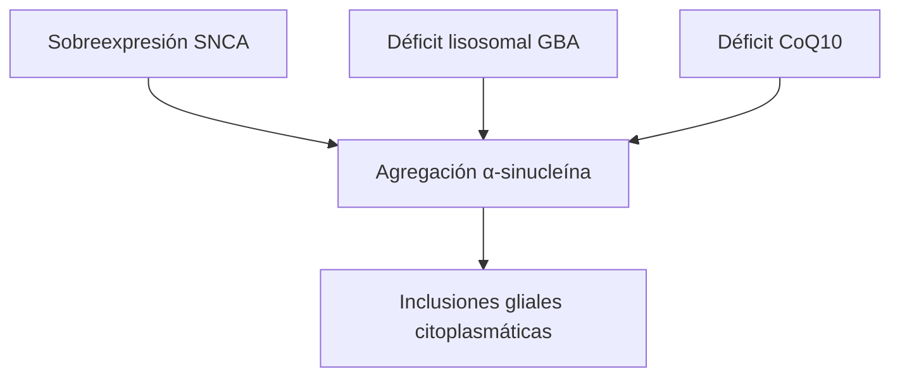

## Identificación del estudio
- **Título:** The genetic basis of multiple system atrophy
- **Autores principales:** Tseng FS (primer autor); Tan EK (senior, National Neuroscience Institute, Singapur)
- **Año:** 2023 · **Revista:** J Transl Med · **DOI:** [10.1186/s12967-023-03905-1](https://doi.org/10.1186/s12967-023-03905-1) · **PMID:** 36765380
- **Tipo de estudio:** **Revisión narrativa** — evaluada con SANRA. La revista la etiqueta "REVIEW" y los autores la llaman "concise review"; no declara búsqueda en ninguna parte, así que **no es sistemática**.
- **Financiamiento:** National Medical Research Council de Singapur · **Conflictos:** ninguno declarado.

## Resumen clínico
### Corpus revisado
- **N de referencias:** 226. **N de estudios incluidos: no aplicable** — sin criterios de elegibilidad, el corpus no es cuantificable.
- **Poblaciones cubiertas:** europea, norteamericana, japonesa, china, coreana e italiana.

### Hallazgos principales
- **No existe forma monogénica de AMS.** Heredabilidad agrupada **2,09–6,65%**.
- **COQ2 V393A:** frecuencia alélica **4,8% en AMS vs 1,6% en controles** en la serie japonesa; **ausente** en las series europeas \[12\].
- Exactitud diagnóstica clínica de la AMS: **\~62%**.

| Gen | Población | Replicado |
| --- | --- | --- |
| SNCA | Europea | Sí |
| SNCA | Asiática | No |
| COQ2 | Japonesa | Solo ahí |

## Evaluación de calidad — SANRA
- **Justificación del tema y pregunta declarada** — Adecuada. El objetivo está enunciado en la introducción y lo que sigue le corresponde.
- **Descripción de la búsqueda** — **No reportada.** Sin bases, fechas ni criterios de elegibilidad. Es el ítem que determina la calificación.
- **Referenciación de las afirmaciones** — Adecuada y por encima de lo habitual: **las asociaciones negativas también** se citan una por una.
- **Evidencia apropiada al peso de la afirmación** — Adecuada. Separa cohortes de diagnóstico clínico de las de diagnóstico neuropatológico.
- **Reconocimiento de la incertidumbre** — Adecuado.
- **Riesgo de sesgo de los estudios incluidos** — No aplica al diseño; SANRA no lo exige.

<callout icon="⚠️" color="orange_bg">
	**Calificación global: Baja.** No por defectos de ejecución —dentro de su género está bien hecha y es honesta sobre sus límites— sino **por su naturaleza**: sin método de búsqueda declarado no hay forma de saber qué quedó fuera. En una revisión narrativa esto es la condición de partida, no un error corregible.
</callout>

## Discusión y limitaciones
El hallazgo que más pesa no es ningún gen: es que **la exactitud diagnóstica clínica ronda el 62%** y que la mayoría de los estudios reclutaron con diagnóstico clínico. Si cuatro de cada diez casos no tienen la enfermedad, cualquier asociación se diluye hacia el nulo.

La comparación entre poblaciones se lee como "no se replicó en asiáticos" cuando las frecuencias alélicas basales difieren por un orden de magnitud. Son dos confusores apilados sobre el mismo contraste.

Para Chile no cambia nada operativo: **el estudio genético en AMS no tiene indicación clínica fuera de investigación**.

## Explicación fisiopatológica
El modelo encadena cuatro vías que convergen en la agregación de α-sinucleína: sobreexpresión (SNCA), degradación lisosomal deficiente (GBA), estrés oxidativo mitocondrial (COQ2) y neuroinflamación.

Lo que queda sin explicar es la pregunta central: **por qué la α-sinucleína se acumula en oligodendrocitos**, células que apenas expresan SNCA.

## Aporte al área
- **Novedad:** ninguna en datos primarios. Su valor es de catálogo.
- **Utilidad práctica:** **ninguna conducta cambia.**
- **A quién aplica:** neurólogo que necesite ubicarse rápido en la genética de AMS.
- **Qué queda pendiente:** un GWAS con potencia real y diagnóstico neuropatológico.

---
*Ficha generada con la skill `analisis-estudio` · 2026-08-27 · texto completo.*
