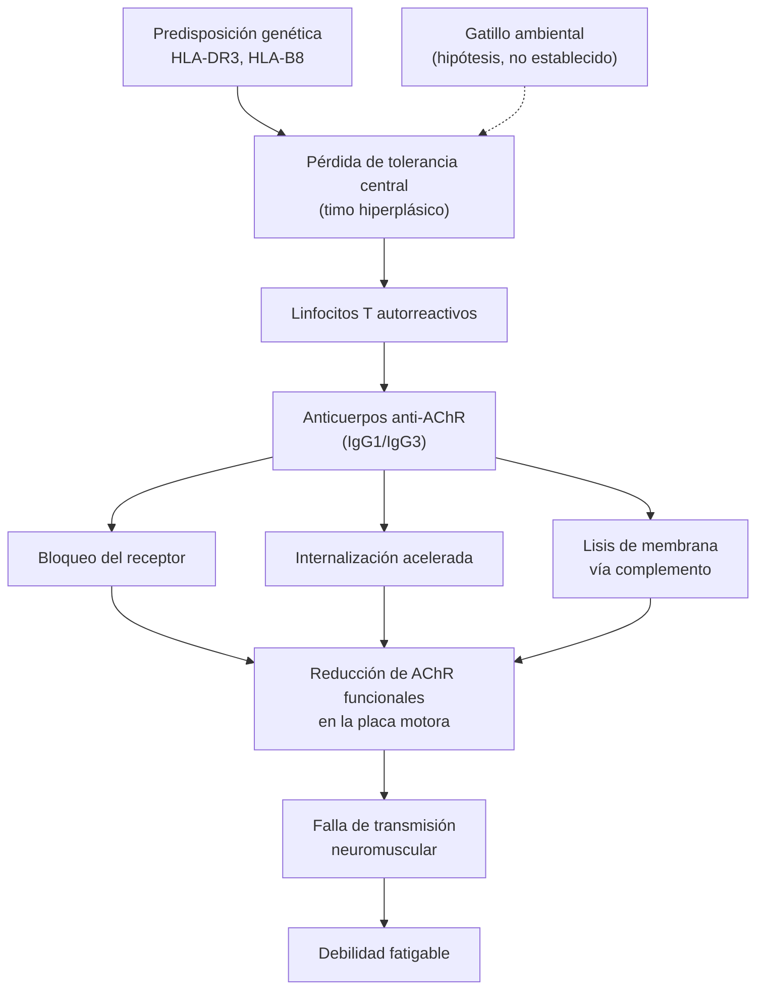
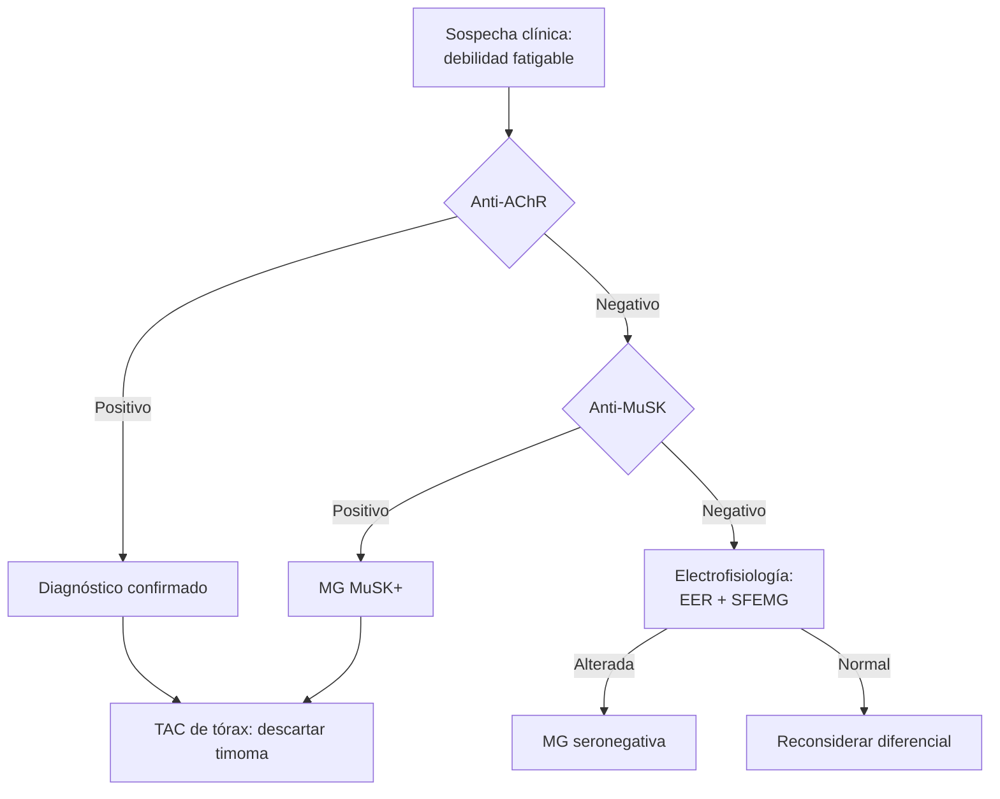

# Figuras y esquemas para Notion

Dos vías, y conviene entender por qué se combinan: los diagramas Mermaid los construyes tú, así
que dicen exactamente lo que el informe necesita decir y nunca se rompen; las figuras
open-access aportan lo que un diagrama no puede (histología real, imágenes, trazados), pero
dependen de una URL ajena y de una licencia.

---

## 1. Diagramas Mermaid

Notion renderiza ` ```mermaid ` de forma nativa al pegar. Un informe bien armado suele llevar
tres: mecanismo fisiopatológico, algoritmo diagnóstico y escalera terapéutica.

**Reglas que evitan que el diagrama falle al pegar:**

- Texto de nodo entre comillas si contiene paréntesis, comas o dos puntos:
  `A["Anticuerpos anti-AChR (85%)"]`. Sin comillas, Mermaid rompe el parseo.
- Sin `<br>` ni HTML; usa `\n` dentro de las comillas para saltar línea.
- Sin emojis en los identificadores de nodo (sí pueden ir en las etiquetas).
- Máximo ~15 nodos por diagrama. Más que eso, divídelo — en Notion se ve minúsculo.
- No uses `style` con colores fijos: chocan con el modo oscuro de Notion. Deja el tema por defecto.

### Fisiopatología — cadena causal

Marca visualmente qué es hipótesis: es la información que se pierde en cualquier otro formato.



La flecha punteada `-.->` para lo no establecido, la sólida para lo demostrado. Explícalo en el
pie de figura para que la convención se lea sola.

### Algoritmo diagnóstico



### Escalera terapéutica

`flowchart LR` para secuencias lineales, o `graph TB` con subgrafos por escenario.

---

## 2. Figuras de fuentes open-access

**Solo enlaza figuras cuya licencia lo permita.** El criterio no es que la figura sea accesible,
sino que sea reutilizable:

| Fuente | Licencia típica | ¿Enlazable? |
|---|---|---|
| PMC Open Access Subset | CC BY / CC BY-NC | Sí, con atribución |
| Wikimedia Commons | CC BY-SA / dominio público | Sí, con atribución |
| Radiopaedia | CC BY-NC-SA | Sí, con atribución |
| Artículos PMC fuera del subset OA | "todos los derechos reservados" | **No** — enlaza el artículo, no la imagen |
| NEJM, Lancet, UpToDate, Elsevier | Propietaria | **No** |

Ante la duda, enlaza el artículo y describe la figura en texto. Es preferible a incrustar una
imagen que el usuario no puede reutilizar.

### Cómo obtener la URL directa en PMC

Las figuras de PMC viven en una ruta estable. Desde la página del artículo
(`https://pmc.ncbi.nlm.nih.gov/articles/PMC1234567/`), la URL directa del archivo tiene la forma:

```
https://cdn.ncbi.nlm.nih.gov/pmc/blobs/<hash>/PMC1234567/<nombre>.jpg
```

**No la construyas a mano y no esperes que te la dé el MCP de PubMed.**
`get_full_text_article` devuelve los *pies* de figura ("Fig. 2. Distribución geográfica...")
pero no las URLs de las imágenes — comprobado. Sirve para saber **qué figuras existen** y
decidir cuál vale la pena; la URL hay que sacarla del HTML:

```
WebFetch https://pmc.ncbi.nlm.nih.gov/articles/PMC12500283/  →  leer el src real de cada 
```

Antes de incluirla, verifica que responde:

```bash
curl -sI "<URL>" | head -1
```

Un `200` sirve; cualquier `403`/`404` significa que Notion mostrará un bloque roto.

### Formato de inserción

La imagen en su propia línea, seguida del crédito. Notion convierte la primera en bloque de
imagen y deja el crédito como texto al pie:

```markdown


*Figura 1. Comparación de la placa motora normal (izq.) y en MG (der.). Fuente: [autor],
Wikimedia Commons, CC BY-SA 4.0. Adaptado de [n].*
```

Toda figura necesita: numeración, qué muestra, fuente, licencia y la referencia del informe a la
que corresponde. Sin eso no es citable y el informe pierde trazabilidad (R10).

### Si no encuentras figura reutilizable

Es el caso frecuente y no es un fracaso. Haz el Mermaid y deja constancia:

> *No se encontró una figura de acceso abierto que ilustre este mecanismo. El esquema anterior
> es una síntesis propia a partir de [3] y [7]. Para las imágenes histológicas originales, ver
> la Figura 2 de [3] (requiere acceso institucional).*

---

## 3. Tablas como alternativa

Cuando lo que quieres mostrar es una comparación y no un proceso, la tabla gana: se lee mejor
en Notion, es buscable, y el usuario puede convertirla en base de datos. Reserva Mermaid para
secuencias, cadenas causales y ramas de decisión.
